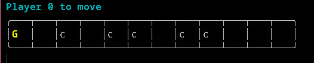
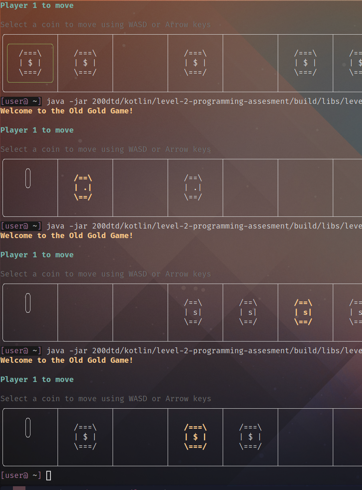

# Results of Testing

The test results show the actual outcome of the testing, following the [Test Plan](test-plan.md)

---

## Board Initialization

The board should generate number of gold coins according to one gold coin, NUM_SILVER_COINS and NUM_BOARD_SPACES compile time constants and generate a board size that is the sum of
all of these. We should not generate the board with a gold coin in board index 0 as the player who starts would instantly win. The board should be generated randomly.

### Test Data Used

Run the game multiple times and observe the result of the generated board.

### Test Result

Initially, this was my code to generate the board:
```kotlin
fun initBoard(state: GameState) {
    //We want to add one gold coin and a random amount of other coins
    state.board.add(GOLD_COIN)
    for(i in 1..NUM_SILVER_COINS) state.board.add(COIN)
    for(i in 1..NUM_BOARD_SPACES) state.board.add(EMPTY)
    state.board.shuffle(Random(System.currentTimeMillis())) //Have to specify source of randomness bug ?
}
```
However, this failed testing as I saw it generated:



This would mean that player 1 could win on their first turn which is undesired behaivour.

Adding a fix for this
```kotlin
//Ensure gold coin does not start at index 0, game would be no fun as player 1 would win instantly!
while(state.board[0]==GOLD_COIN) state.board.shuffle(Random(System.currentTimeMillis())) //Have to specify source of randomness bug ?
```
The board initialization now works as intended.


---

## Example Test Name

Example test description. Example test description.Example test description. Example test description.Example test description. Example test description.

### Test Data Used

Details of test data. Details of test data. Details of test data. Details of test data. Details of test data. Details of test data. Details of test data.

### Test Result


Comment on test result. Comment on test result. Comment on test result. Comment on test result. Comment on test result. Comment on test result.

---

