# Results of Testing

The test results show the actual outcome of the testing, following the [Test Plan](test-plan.md)

These include 
 - player name testing
 - moving cursor to select
 - confirming select
 - moving cursor to move
 - confirming move
 - removing coin
 - winning game
 - misc.

---
# Player name testing

### Testing: Player name input **(VALID)**
Each player is asked their name and this is stored. If they enter a blank name, it should not accept this and ask them again.

#### Test Data
eg
`"Connor", "bingus"`
#### Test Result
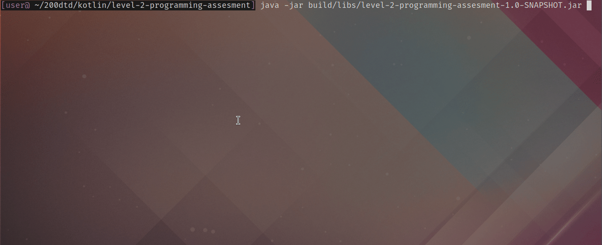
passed: player names are stored and program continues


### Testing: Player name input **(INVALID)**
If the player attempts to or accidentally enters a blank name, it should prompt them to enter their name again.
A blank name is one with no characters or comprised entirely of invisible characters.

#### Test Data
`"", " ", "    "`
(no char, single space, 4x space)

#### Test Result
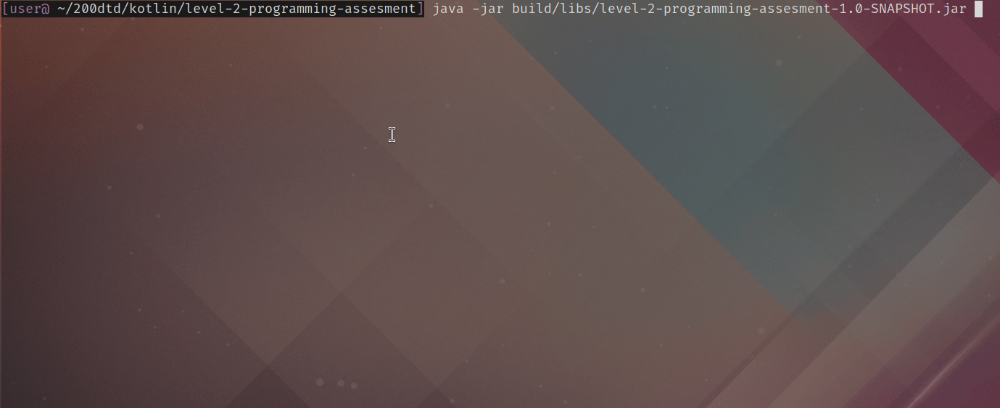
passed: program prompts player for valid name and allows them to enter their name again.


---
# Moving cursor to select coin


### Testing: Moving Cursor to select coin **(VALID)**
The program has to get input on each player's turn on what coin they want to move. They should do this by pressing the arrow keys or WASD to move a cursor left or right to above wished coin to select.
#### Test Data
Use arrow keys to navigate to a valid coin and press enter. This **will not** involve selecting an invalid coin or navigating off the board.
e.g. to select a coin at index 2 starting at index 0.
`__C`
`RIGHT, RIGHT`
and all other combinations like
`RIGHT, RIGHT, LEFT, RIGHT`
also accepted as they result in cursor at the same place without moving to the edges of the board

#### Test Result
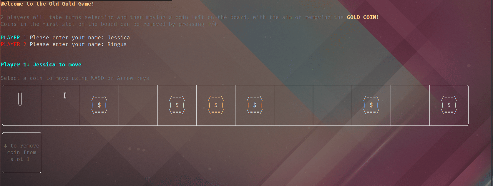
passed: cursor moves right on right keypress and left on left keypress


### Testing: Moving cursor to select coin ends of board **(BOUNDARY)**
The program has to get input on each player's turn on what coin they want to move. They should do this by pressing the arrow keys or WASD to move a cursor left or right to above wished coin to select.
#### Test Data 
We will use arrow keys to move cursor to the very edges of the board.
`RIGHT x11` (starting at 0 and moving to slot 11)
#### Test Result
The cursor should move to the very right end of the board on the 11th right key press.

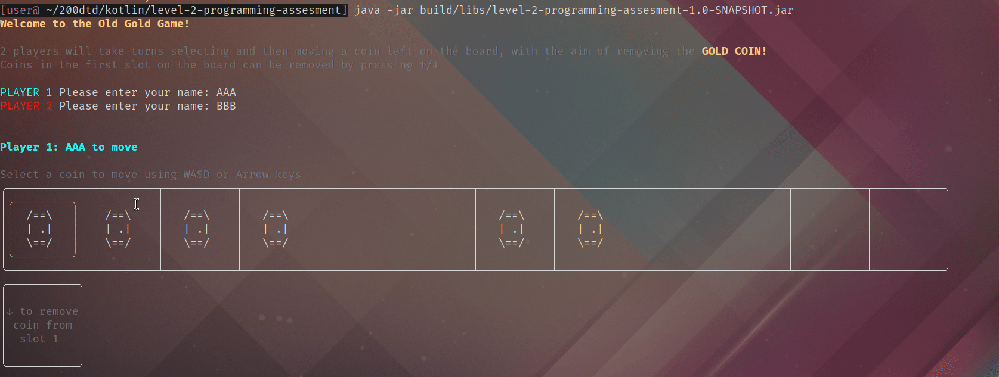
passed: the program allowed the cursor to move to the end of the board in the correct amount of key presses


### Testing: Moving cursor to select coin **(INVALID)**
The program has to cope with invalid keypresses to avoid unintended behaviour.
#### Test Data 
We will use keys **other** than arrow and WASD and enter/space.
`zxc(90jklmzrgt`
#### Test Result
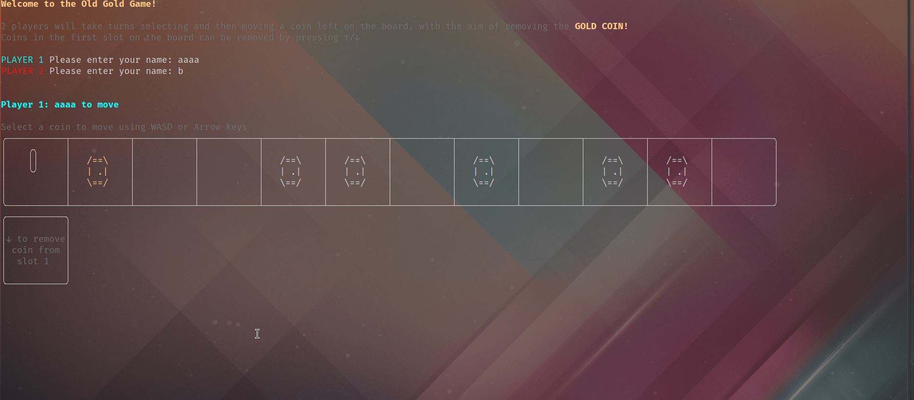
passed: the program rejected the irrelevant key-presses.


### Testing: Moving cursor to select coin **(INVALID)**
Testing whether the cursor will not move off the board.

#### Test Data 
Move cursor to far left or far right of the board and try to move past this.
 `LEFT` and `RIGHT x12`

#### Test Result
The cursor should not be able to move off the board under any circumstance and so the program will ignore this input.

passed: the program ignores this input and the cursor stays on the board.


---
# Confirming coin select 

### Testing: Selecting a coin (VALID)
When the cursor is over a coin that can be moved by more than one space (so not boundary), the user should press space and enter and the program stores the coin and enters selection mode.

#### Test Data 
Select a coin with more than one space to the left able to be moved
eg selecting coin in this example.
`*__C .....`

####  Test Result

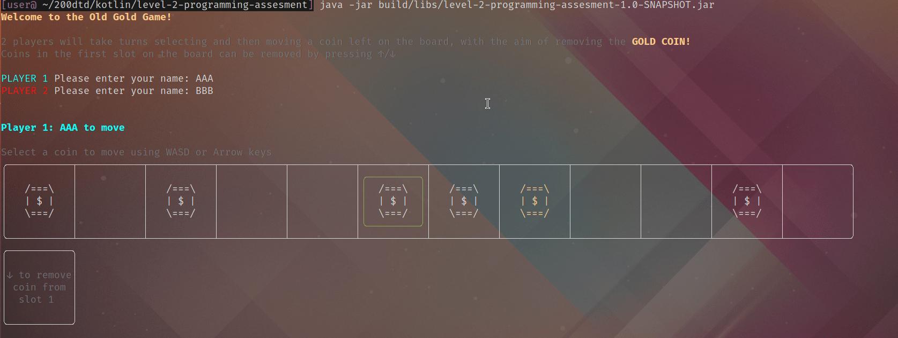
passed: the program successfully selected the coin and entered moving mode.


### Testing: Selecting coin with only one possible move (BOUNDARY)
Selecting a coin where there is only one possible place to move is a boundary case but still possible.
This tests the program recognising how many moves are possible for a coin.
#### Test Data 
Select 2nd ex coin
`*_C ...`
####  Test Result

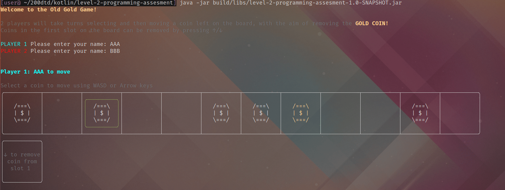
passed: the program successfully selected the coin and entered moving move.


### Testing: Selecting coin with 11 possible moves (Boundary)
Test whether we can select a coin with the maximum amount of moves possible for given board size to test the
program recognising how many moves are possible for a coin.
#### Test data 
`__________G`
move cursor to far right and press `ENTER` to select coin
#### Test result
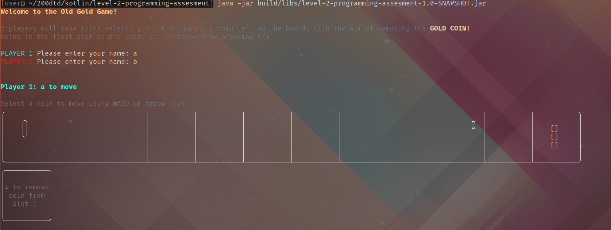
passed: program allowed us to select coin on far right edge of board


### Testing: Selecting a coin in the far left of the board (BOUNDARY)
The coin in the left cell about to be removed is a boundary case but the user should be able to select this.
#### Test Data 
Select coin in ex:
`C**** ...`
`ENTER`
####  Test Result
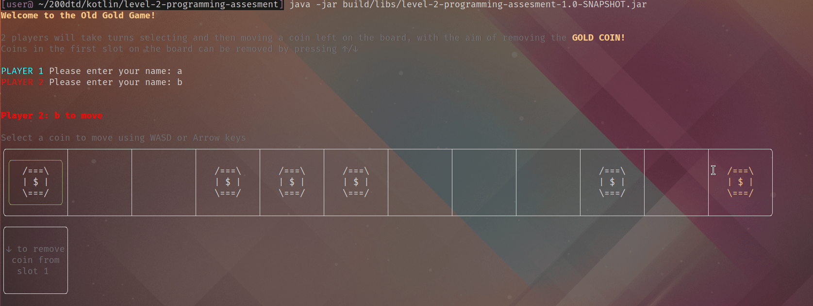
passed: program allowed us to select coin on far left of board.

### Testing: Selecting a coin with no moves (INVALID)
If there is a coin immediately to the left of our coin, there are no valid moves and therefore the coin should not be selectable.
#### Test Data 
press enter/space to select coin on right in this example.
`... CC ...`
`ENTER x3, SPACE x3`
#### Test Result

passed: the program ignores these selection attempts.

### Testing: Selecting an empty space (INVALID)
If the user tries to selects an empty cell, this is not a valid coin to select.
#### Test data 
`... _ ...`
`ENTER x3, SPACE x3`

pressing enter/space with cursor selecting empty space.
####  Test Result

passed: the program ignores this input 


---
# Moving a coin 

### Testing: Moving A Coin (INVALID)

The user should only be able to move the cursor to the left of the coin they have selected that they want to move.
This is to prevent the user moving a coin to the right initially as it is a clear indication that they can not do this.

#### Test Data 

We can select a coin and then try to move the cursor right e.g. from index 0 to coin at 2:
`D, D, ENTER, D x 12 RIGHT, RIGHT`

#### Test Result

passed: the cursor did not move right, preventing an illegal move from being played.


### Testing: Moving a coin (INVALID)
The user should only be able to move their cursor to a valid place on the board. This means that when moving, the cursor should not be able to
be moved further to the left than the greatest possible move, ie not be able to be moved onto the next coin on the board, only empty spaces.

#### Test Data 
following setup
`C___C ...`
right coin selected then: ` LEFT x3, A x2, LEFT`
#### Test Result

passed: program would not let cursor overlap with the coin to the left, preventing an illegal move.


### Testing: Moving a coin (VALID)
The user should be able to move their cursor as many places left as they wish as long as it is a valid move.
#### Test Data 
`___C ...`
enter/space pressed at index 3 of ex then: `LEFT x2`
#### Test Result
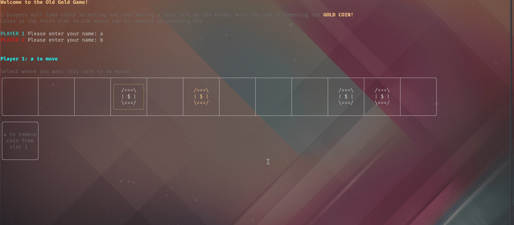
passed: program allowed cursor to move to the left a valid number of places.


---
# Confirming coin move 


### Testing: Confirm coin move (VALID)
Testing whether once a coin is selected and cursor moved to a different valid slot the program will move the coin and switch player's turns once
enter is pressed.
#### Test Data 
`_|_C`
`ENTER`
### Test Result

passed: the coin moves to the correct position 

### Testing: Confirm coin not move and return to selecting (VALID)
The user should be able to cancel moving a selected coin by 'trying to move the coin to it's original position'
#### Test Data 
Press enter to select coin
`ENTER`
Not move cursor and press enter
`ENTER`
#### Test Result

passed: the coin did not move and it remained the player's turn, switching back to select mode.


### Testing: Confirming coin move (BOUNDARY)
The program should allow the user to move the coin just one slot in the board.
#### Test data 
`___|C`
`ENTER`
Select coin, move cursor to left and press enter
#### test result
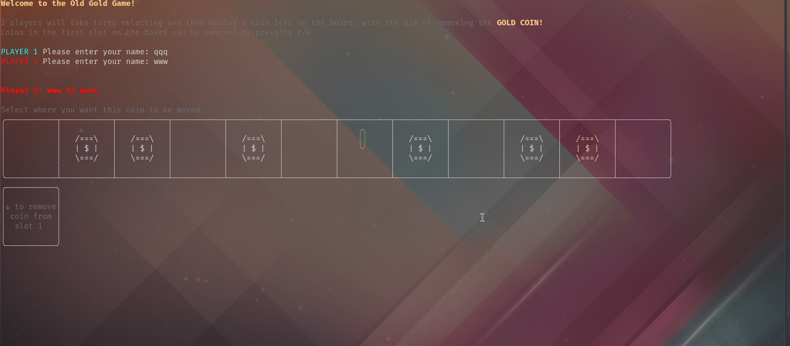
passed: the program allows the coin to move one space to the left and it progresses to the next players turn.


### Testing: Confirming coin move (BOUNDARY)
The program should allow the user to move the coin the greatest possible distance (11 spaces).
#### Test data to use
`|__________G`
`ENTER`
#### Expected test result
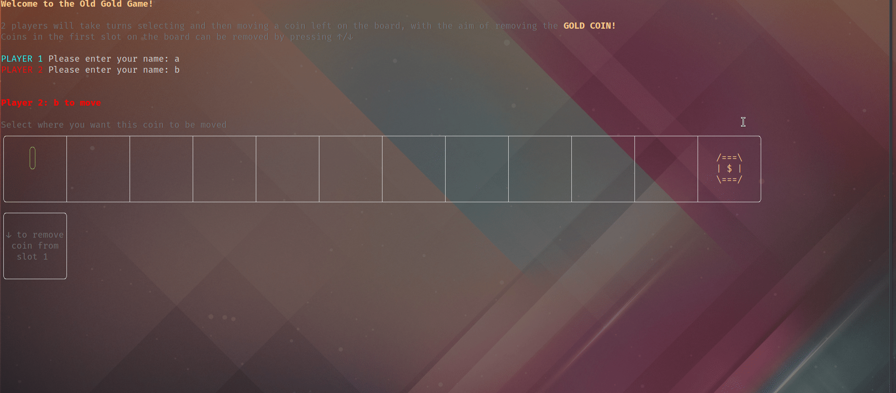
passed: the program handled this boundary case and the coin moved to the far left side and progressed to the next player's turn.


---
# Removing Coins

### Testing: Player removing GOLD coin (valid)
Test whether the program recognises removing a gold coin as a win
#### Test Data 
`G___...`
`|`
(cursor in off board position with gold coin selected in index 0) press `ENTER`
#### Test Result
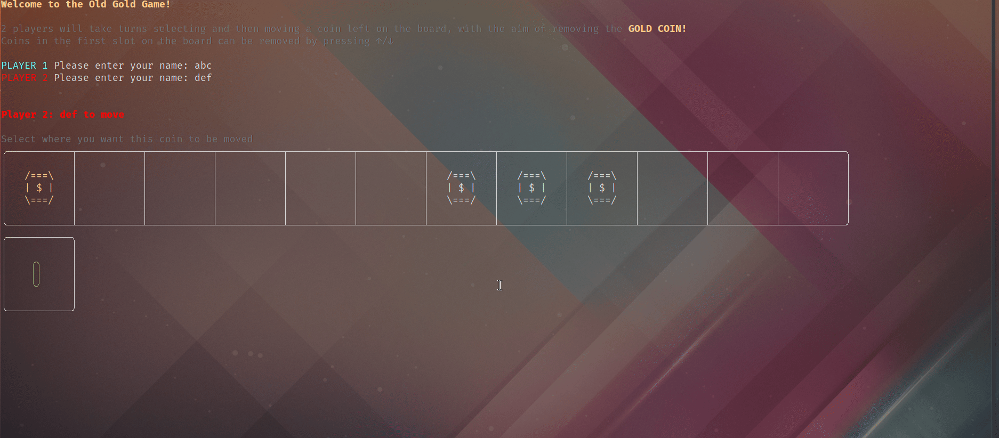
passed: coin is removed and the winning player is congratulated and then the program exits.


### Testing: Player removing normal coin (valid)
Tests removing a normal (silver) coin from index 0
#### Test Data 
`C____ ...`
`|`
#### Test Result
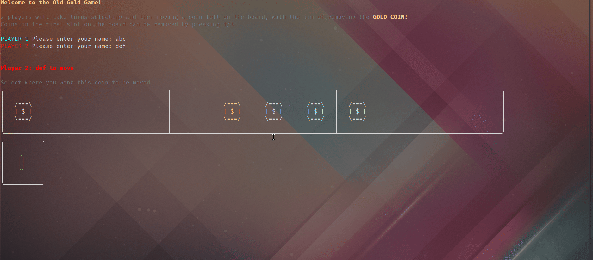
passed: coin is removed and program switches to other player turn in select mode


---
# Winning a Game 


### Testing: Player 1 winning game
Player 1 should be able to win the game by removing gold coin from board.
#### Test Data 
Gold coin in index 0.
Player 1 uses their turn to remove coin.
#### Test Result
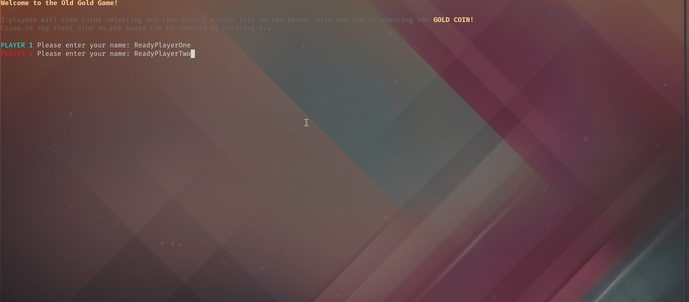


### Testing: Player 2 winning game
Player 2 should be able to win the game by removing gold coin from board.
#### Test Data 
Gold coin in index 0.
Player 2 uses their turn to remove coin.
####  Test Result
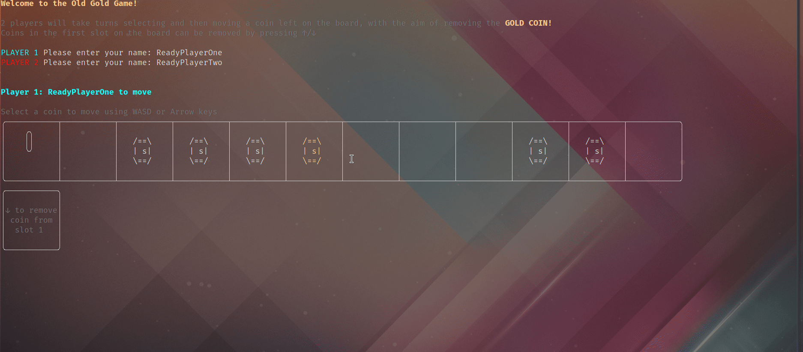


---
# Misc. Testing


### Testing: Quitting program
The user should be able to quit out of the main game loop to exit the game.

#### Test Data 
In game loop
`q`
#### Test Result
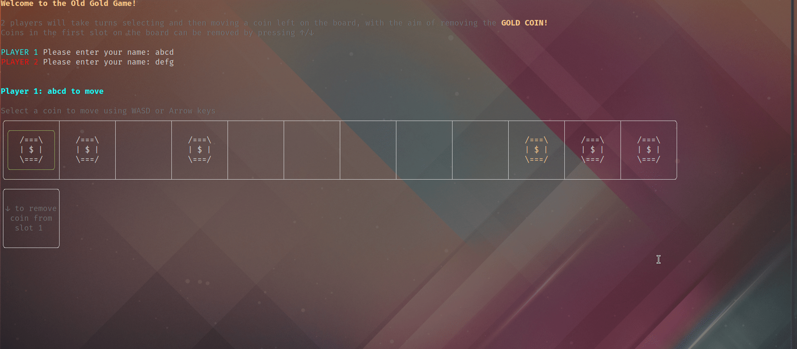


## Board Initialization

The board should generate number of gold coins according to one gold coin, NUM_SILVER_COINS and NUM_BOARD_SPACES compile time constants and generate a board size that is the sum of
all of these. We should not generate the board with a gold coin in board index 0 as the player who starts would instantly win. The board should be generated randomly.

### Test Data Used

Run the game multiple times and observe the result of the generated board.

### Test Result

Initially, this was my code to generate the board:
```kotlin
fun initBoard(state: GameState) {
    //We want to add one gold coin and a random amount of other coins
    state.board.add(GOLD_COIN)
    for(i in 1..NUM_SILVER_COINS) state.board.add(COIN)
    for(i in 1..NUM_BOARD_SPACES) state.board.add(EMPTY)
    state.board.shuffle(Random(System.currentTimeMillis())) //Have to specify source of randomness bug ?
}
```
However, this failed testing as I saw it generated:

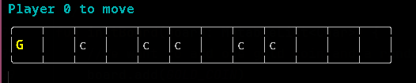

This would mean that player 1 could win on their first turn which is undesired behaivour.

Adding a fix for this
```kotlin
//Ensure gold coin does not start at index 0, game would be no fun as player 1 would win instantly!
while(state.board[0]==GOLD_COIN) state.board.shuffle(Random(System.currentTimeMillis())) //Have to specify source of randomness bug ?
```
The board initialization now works as intended with no gold coins generated in index 0.
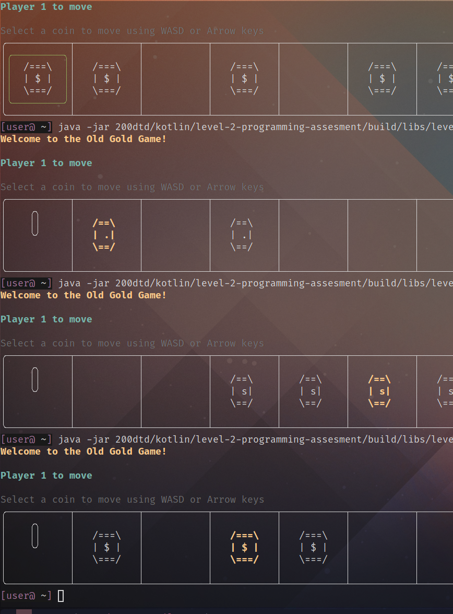

### Testing: Board Display With No Coins (valid/boundary)
The board should keep the board size consistent even with the cursor moving and coins being removed.
#### Test Data
Removed all coins from the board.
#### Test Result 
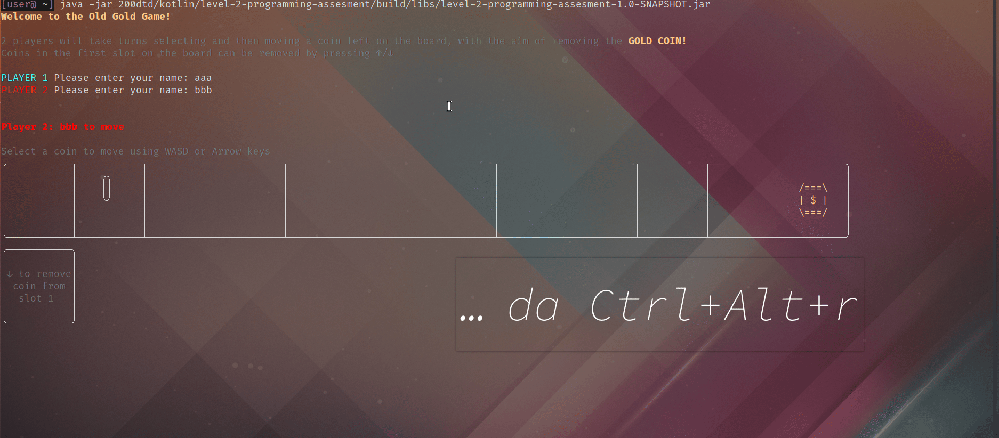
FAILED: the board size changes when all the coins are removed. This is bad because it will always happen when the game generated the gold coin in the far right cell.
This suggests that the height of the board is not constant and linked to the height of a coin.
```kotlin
when(slot) {
    GOLD_COIN ->handleBoardCell(state,index,GOLD_COL,coinAnim)
    COIN -> handleBoardCell(state,index,SILVER_COL,coinAnim)
    EMPTY -> {
    //Can't extract this into printBoardCell as receivership of TextAnim and String as one param is not supported and other logic would be less efficient
    if (state.cursorIndex == index) {
        if(state.playerTurnProgress==1){
            color(SELECTABLE_COL)
        } else {
            color(UNSELECTABLE_COL)
        }
        bordered(BorderCharacters.CURVED) {}
        }
    }

}
```
It seems that when the board has no coins and no cursor, the board has no minimum height and so breaks.
We could fix this with a grid() option in kotter, but there is no minCellHeight or similar
This means we have to pad out the cell to height 7 where there is no coins or cursor.
```kotlin
when(slot) {
                    GOLD_COIN ->handleBoardCell(state,index,GOLD_COL,coinAnim)
                    COIN -> handleBoardCell(state,index,SILVER_COL,coinAnim)
                    EMPTY -> {
                        //Can't extract this into printBoardCell as receivership of TextAnim and String as one param is not supported and other logic would be less efficient
                        if (state.cursorIndex == index) {
                            if(state.playerTurnProgress==1){
                                color(SELECTABLE_COL)
                            } else {
                                color(UNSELECTABLE_COL)
                            }
                            bordered(BorderCharacters.CURVED) {}
                        }
                        textLine("\n ".repeat(7))
                    }

                }
```
Rerunning test:
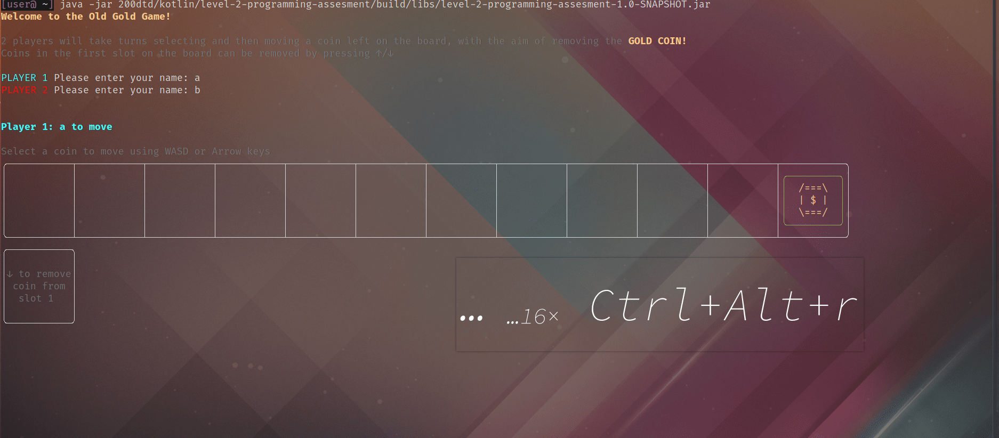
passed: the board size does not now change.


---

## Example Test Name

Example test description. Example test description.Example test description. Example test description.Example test description. Example test description.

### Test Data Used

Details of test data. Details of test data. Details of test data. Details of test data. Details of test data. Details of test data. Details of test data.

### Test Result


Comment on test result. Comment on test result. Comment on test result. Comment on test result. Comment on test result. Comment on test result.


---

